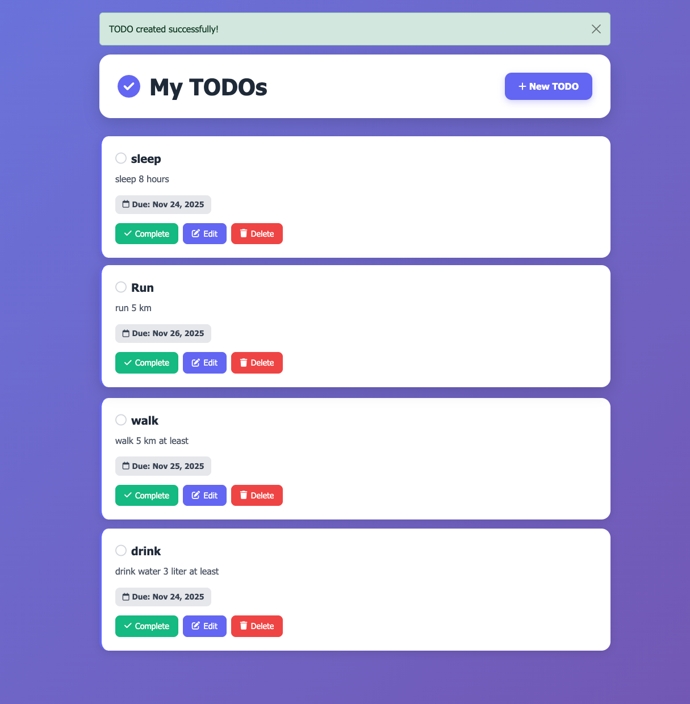

# Todo Application

This is a simple Todo application built with Django. It allows users to manage their tasks by providing CRUD (Create, Read, Update, Delete) functionality.

## Screenshot



## Features

*   **Create Todo:** Add new tasks to your todo list.
*   **View Todos:** See a list of all your tasks.
*   **Edit Todo:** Modify existing tasks.
*   **Delete Todo:** Remove tasks from your list.
*   **Mark as Resolved:** Mark tasks as completed.
*   **Due Dates:** Assign due dates to your tasks.

## Getting Started

To get a local copy up and running follow these simple steps.

### Prerequisites

*   Python 3.10 or later

### Installation

1.  Clone the repository:
    ```bash
    git clone https://github.com/your-username/todo.git
    cd todo
    ```
2.  Create a virtual environment and activate it:
    ```bash
    uv venv
    source .venv/bin/activate
    ```
3.  Install the dependencies:
    ```bash
    uv pip install -r requirements.txt
    ```
4.  Run database migrations:
    ```bash
    python manage.py migrate
    ```
5.  Start the development server:
    ```bash
    python manage.py runserver
    ```

The application will be available at `http://127.0.0.1:8000/`.

## Built With

*   [Django](https://www.djangoproject.com/) - The web framework used
*   [Bootstrap](https://getbootstrap.com/) - For styling
*   [SQLite](https://www.sqlite.org/) - Database